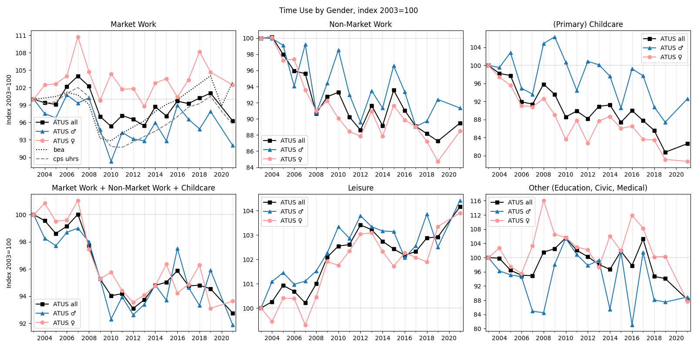
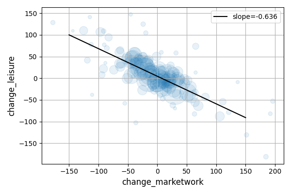
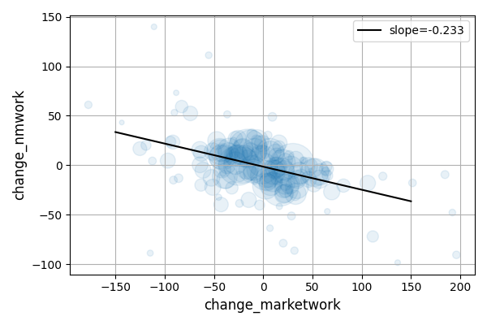

<!--
date: 2023-04-21
last_modified_date: 2022-10-16-->

<!--source code for graphs is from papersdrafts\covid_unemployment-->

This post follows the techniques from [Time Use during the Great Recession](https://www.aeaweb.org/articles?id=10.1257/aer.103.5.1664)[^aguiar2013time]
and extends them to cover more recent data.
State of this post: still rough.
<!--The state of this post is rough, and doesn't always handle the data in the most rigourous way.-->

[^aguiar2013time]: Aguiar, Mark, Erik Hurst, and Loukas Karabarbounis. 2013. "Time Use during the Great Recession." *American Economic Review*, 103 (5): 1664-96.

## Data Source

The data here comes from the [American Time Use Survey (ATUS)](https://www.bls.gov/tus/), accessed through [IPUMS](https://www.atusdata.org)[^Flood_2022]

[^Flood_2022]: Sarah M. Flood, Liana C. Sayer and Daniel Backman. American Time Use Survey Data Extract Builder: Version 3.1 [dataset]. College Park, MD: University of Maryland and Minneapolis, MN: IPUMS, 2022. [https://doi.org/10.18128/D060.V3.1](https://doi.org/10.18128/D060.V3.1)

Each respondent was asked to describe how they spent the previous day.
Following [Aguiar et al's appendix](https://assets.aeaweb.org/asset-server/articles-attachments/aer/data/aug2013/20110981_app.pdf), 
I grouped time use into the following mutually exclusive categories:

1. Market Work
2. Other Income-Generating Activities
3. Job Search
4. Child Care[^primarychildcare]
5. Non-Market Work (shopping, housework, etc.)
    - Core Home Production
    - Home Ownership Activities
    - Obtaining Goods and Services
    - Others Care (eg taking care of the elderly)
6. Leisure
    - TV Watching
    - Socializing
    - Sleep
    - Eating and Personal Care 
    - Other Leisure
7. Other (education, seeking medical care, voting...)
    - Education
    - Civic
    - Own Medical
    - Unclassified

<!--grooming is kind of a work activity, really-->

Also following their procedure, I restrict the sample to those who are
- between the ages of 18 and 65, inclusive
- didn't report any time use activities which ATUS workers were unable to classify.

[^primarychildcare]: This only includes "primary child care", meaning time spent on activities where caring for a child is the main focus. Time spent on secondary child-care -- watching children while doing something like cooking or reading a book -- isn't included.

## Time Use of Men and Women

Something very striking about Time Use data 
is the similarity in average leisure time 
between men and women.

Likewise for average 'total work' time:
Men spend more hours working for pay.
Women spend more hours on home-production and childcare.
Yet when all these difficult activities are added up, 
the averages end up the same for men and women.

The above graph plots the weighted averages
of various categories of time use, by year.
There is no point for 2020 on this graph because ATUS workers were unable to collect survey responses for a portion of that year.[^atus2020note]
Lines are plotted for the entire sample, as well as for the subsamples restricted to men or women.

<!--
[^weightingnote]: The statistical weighting used for this post isn't fully consistent. Because of COVID, the ATUS poll workers were unable to collect responses from March 18th to May 9th or 2020. As such, the typical statistical weighting method doesn't work. The ATUS provides two sets of statistical weights: One for all years except 2020 (`wt06` in IPUMS), and one for only 2019 and 2020 (`wt20`). For ease of making this post, I simply used `wt20` for 2020, and `wt06` for all other years. 
-->

[^atus2020note]: Because of COVID, the ATUS poll workers were unable to collect responses from March 18th to May 9th of 2020. [As per the ATUS user's guide](https://www.bls.gov/tus/atususersguide.pdf) (see section 9.2) it is thus impossible to properly construct average time use estimates for 2020 as a whole. Any averages over 2020 are merely averages over the ten month period when data was collected (which excludes the most dramatic two months!)

Normalized graphs - Click to expand.

Here's a similar graph, 
but plotting how much each time use category has changed since 2003.

In the first subplot, the `bea` line plots the 
[hours worked by full-time and part-time employees](https://fred.stlouisfed.org/series/B4701C0A222NBEA) 
divided by the
[working-age population](https://fred.stlouisfed.org/series/LFWA64TTUSM647S).
The `cps uhrs` line plots the weighted average of "Hours usually worked per week at all jobs" among CPS respondents.

The following graph is similar, but with each line 
seperately normalized with index 2003=100.

In  [Measuring Trends in Leisure: The Allocation of Time Over Five Decades](https://www.nber.org/papers/w12082)[^aguiar2007measuring],
the authors describe a similar pattern holding up over multiple decades.
By connecting multiple data sources on time use, 
they show that since the 1960s, men work (for pay) less on average and women more; 
men do more non-market work and women less;
and the change in average total work time has declined by the same amount for each sex.

[^aguiar2007measuring]: Aguiar, M. and Hurst, E., 2007. Measuring trends in leisure: The allocation of time over five decades. *The quarterly journal of economics*, 122(3), pp.969-1006.

## Unconditional Time Use Changes 

| Time Use Category | 2019 mean | 19-20 change[^altweightnote] | 19-21 change |
|:--|:-:|:-:|:-:|
| **Market Work** | 31.984 | -3.64 | -1.508 |
| **Other IGA** | 0.253 | -0.078 | -0.072 |
| **Job Search** | 0.343 | -0.101 | 0.034 |
| **Childcare** | 3.97 | 0.042 | 0.092 |
| **Non-Market Work** | 16.489 | 1.252 | 0.424 |
| core HP | 9.122 | 1.044 | 0.849 |
| other care | 1.057 | -0.02 | -0.008 |
| homeownership | 1.76 | 0.703 | 0.085 |
| shopping | 4.55 | -0.475 | -0.502 |
| **Leisure** | 110.164 | 2.682 | 1.331 |
| eating and pcare | 13.139 | -0.937 | -0.279 |
| sleep | 61.88 | 1.253 | 0.542 |
| socializing | 7.355 | 0.339 | 0.647 |
| leisure_tv | 17.751 | 1.327 | 0.173 |
| other leisure | 10.041 | 0.699 | 0.248 |
| **Other** | 4.797 | -0.157 | -0.301 |
| other_civic | 1.67 | -0.447 | -0.41 |
| other_education | 2.396 | 0.136 | -0.128 |
| other_ownmedical | 0.731 | 0.153 | 0.237 |

Units for each column are hours per week.

[^altweightnote]: Calculated using ATUS' alternate weighting scheme for 2020

<!--
2019-2020 change calculated using wt20
2019-2021 change calculated using wt06
2019 average calculated using wt06
-->

<!--
Here, the after-COVID period is defined as 2020 June to 2021 December.
And the before-COVID period is defined as 2018 June to 2019 December,
just to get a similar length of time.
--> 

## Regressions on Cross-State Variation

Following (Aguiar, Hurst, Karabarbounis 2013),
I fit regressions of the following form:

$$\Delta \tau_{j,st} = \alpha_j + \beta_j \Delta \tau_{market,st} + \varepsilon_{j,st}$$

where $\tau_{j,st}$ is the weighted average time spent on time-use category $j$
in state $s$, during time period $t$.

Time periods are two-year blocks:
2004 and 2005 together; 2006 and 2007; ... 2018 and 2019; and 2020 and 2021.
This kind of two-year blocking was done in the original paper because ATUS doesn't garuntee representative sampling within each state.
Quote:

> Averaging over the two years helps to mitigate measurement error in our dataset due to sampling variation within the survey at the state level.

But I'm concerned that this kind of 2-year blocking would obscure what we're interested in
when looking at time use changes in 2020 and 2021 in response to COVID.
The shocks from COVID really weren't usual business cycles.

### Coefficient Tables and scatterplots

<!--For full set from 2004-2021, in 2 year blocks.-->

| Time Use Category | pre-covid mean | % of non-labor time | unweighted $\hat\beta$ | weighted $\hat\beta$ |
|:--|:-:|:-:|:-:|:-:|
| **Other IGA**       | 0.2   | 0.1%  | -0.013 | -0.005 |
| **Job Search**      | 0.3   | 0.2%  | -0.017 | -0.012 |
| **Childcare**       | 4.7   | 3.3%  | -0.028 | -0.047 |
| **Non-Market Work** | 18.1  | 12.3% | -0.234 | -0.259 |
| core HP             | 9.4   | 6.4%  | -0.112 | -0.142 |
| other care          | 1.4   | 0.9%  | -0.028 | -0.027 |
| homeownership       | 2.2   | 1.5%  | -0.047 | -0.038 |
| shopping            | 5.0   | 3.5%  | -0.047 | -0.052 |
| **Leisure**         | 108.1 | 80.7% | -0.579 | -0.578 |
| eating and pcare    | 13.3  | 10.4% | 0.048  | 0.018  |
| sleep               | 59.6  | 45.6% | -0.145 | -0.178 |
| socializing         | 7.7   | 5.3%  | -0.101 | -0.103 |
| TV                  | 17.6  | 12.5% | -0.233 | -0.208 |
| other leisure       | 9.8   | 7.0%  | -0.148 | -0.108 |
| **Other**           | 5.1   | 3.4%  | -0.129 | -0.099 |
| other_civic         | 2.0   | 1.4%  | -0.035 | -0.034 |
| other_education     | 2.1   | 1.4%  | -0.066 | -0.047 |
| other_ownmedical    | 1.0   | 0.6%  | -0.028 | -0.018 |

And the following is when the data is restricted to 2014 and onwards:
<!--2014 and 2015 together; 2016 and 2017; 2018 and 2019; and 2020 and 2021.-->

| Time Use Category | pre-covid mean | % of non-labor time | unweighted $\hat\beta$ | weighted $\hat\beta$ |
|:--|:-:|:-:|:-:|:-:|
| **Other IGA**       | 0.2   | 0.1%  | -0.013 | -0.007 |
| **Job Search**      | 0.3   | 0.2%  | -0.01  | -0.011 |
| **Childcare**       | 4.3   | 3.0%  | -0.017 | -0.02  |
| **Non-Market Work** | 17.0  | 11.5% | -0.27  | -0.233 |
| core HP             | 9.4   | 6.4%  | -0.138 | -0.136 |
| other care          | 1.1   | 0.8%  | -0.016 | -0.015 |
| homeownership       | 1.8   | 1.2%  | -0.066 | -0.042 |
| shopping            | 4.6   | 3.1%  | -0.049 | -0.041 |
| **Leisure**         | 109.8 | 81.8% | -0.592 | -0.636 |
| eating and pcare    | 13.0  | 10.2% | 0.075  | 0.042  |
| sleep               | 61.4  | 46.9% | -0.169 | -0.181 |
| socializing         | 7.5   | 5.1%  | -0.137 | -0.14  |
| TV                  | 17.9  | 12.6% | -0.219 | -0.234 |
| other leisure       | 10.0  | 7.1%  | -0.141 | -0.123 |
| **Other**           | 5.0   | 3.3%  | -0.099 | -0.094 |
| other_civic         | 1.9   | 1.3%  | -0.037 | -0.028 |
| other_education     | 2.3   | 1.5%  | -0.054 | -0.058 |
| other_ownmedical    | 0.9   | 0.6%  | -0.007 | -0.008 |

 

