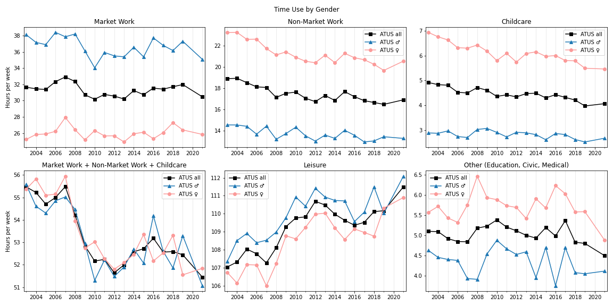

<!--last_modified_date: 2022-10-16-->

<!--source code for graphs is from papersdrafts\covid_unemployment-->

This page follows the techniques from [Time Use during the Great Recession](https://www.aeaweb.org/articles?id=10.1257/aer.103.5.1664)[^aguiar2013time]
and extends them to cover more recent data.

[^aguiar2013time]: Aguiar, Mark, Erik Hurst, and Loukas Karabarbounis. 2013. "Time Use during the Great Recession." *American Economic Review*, 103 (5): 1664-96.

## Data Source

The data here comes from the [American Time Use Survey (ATUS)](https://www.bls.gov/tus/), accessed through [IPUMS](https://www.atusdata.org)[^Flood_2022]

[^Flood_2022]: Sarah M. Flood, Liana C. Sayer and Daniel Backman. American Time Use Survey Data Extract Builder: Version 3.1 [dataset]. College Park, MD: University of Maryland and Minneapolis, MN: IPUMS, 2022. [https://doi.org/10.18128/D060.V3.1](https://doi.org/10.18128/D060.V3.1)

Each respondent was asked to describe how they spent the previous day.
Following [Aguiar et al's appendix](https://assets.aeaweb.org/asset-server/articles-attachments/aer/data/aug2013/20110981_app.pdf), 
I grouped time use into the following mutually exclusive categories:

1. Market Work
2. Other Income-Generating Activities
3. Job Search
4. Child Care[^primarychildcare]
5. Non-Market Work (shopping, housework, etc.)
6. Leisure
7. Other (education, seeking medical care, voting...)

Also following their procedure, I restrict the sample to those who are
- between the ages of 18 and 65, inclusive
- didn't report any time use activities which ATUS workers were unable to classify.

[^primarychildcare]: This only includes "primary child care", meaning time spent on activities where caring for a child is the main focus. Time spent on secondary child-care -- watching children while doing something like cooking or reading a book -- isn't included.

## Time Use of Men and Women

Something very striking about Time Use data 
is the similarity in average leisure time 
between men and women.

Likewise for average 'total work' time:
Men spend more hours working for pay.
Women spend more hours on home-production and childcare.
Yet when all these difficult activities are added up, 
the averages end up the same for men and women.

The above graph plots the weighted averages[^weightingnote]
of various categories of time use, by year.
It must be noted that for 2020, the averages are not representative of the entire year.[^2020note]
Lines are plotted for the entire sample, as well as for the subsamples restricted to men or women.

[^weightingnote]: The statistical weighting used for this post isn't fully consistent. <!--There are some complications with weighting ATUS data for a time series that includes 2020.--> Because of COVID, the ATUS poll workers were unable to collect responses from March 18th to May 9th or 2020. As such, the typical statistical weighting method doesn't work. The ATUS provides two sets of statistical weights: One for all years except 2020 (`wt06` in IPUMS), and one for only 2019 and 2020 (`wt20`). For ease of making this post, I simply used `wt20` for 2020, and `wt06` for all other years. 

[^2020note]: [As per the ATUS user's guide](https://www.bls.gov/tus/atususersguide.pdf) (see section 9.2) it is impossible to properly construct average time use estimates for 2020. Any averages over 2020 are merely averages over the ten month period when data was collected (which excludes the most dramatic two months!)

In  [Measuring Trends in Leisure: The Allocation of Time Over Five Decades](https://www.nber.org/papers/w12082)[^aguiar2007measuring],
the authors describe a similar pattern holding up over multiple decades.
By connecting multiple data sources on time use, 
they show that since the 1960s, men work (for pay) less on average and women more; 
men do more non-market work and women less;
and the change in average total work time has declined by the same amount for each sex.

[^aguiar2007measuring]: Aguiar, M. and Hurst, E., 2007. Measuring trends in leisure: The allocation of time over five decades. *The quarterly journal of economics*, 122(3), pp.969-1006.