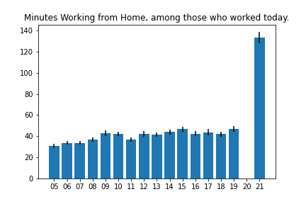
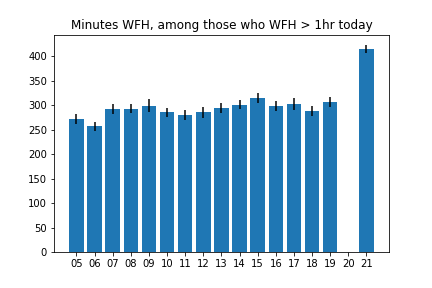
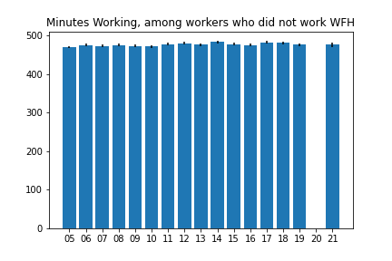
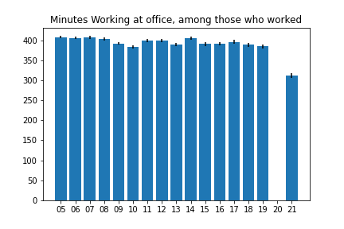

Below are some graphs made using data from the American Time Use Survey.
Post pandemic, a lot of people shifted to working from home, and I wanted to see the magnitude of that change.

Data from 2020 is excluded because the BLS had difficulty collecting data that year, and the methodology for interpreting the data is different for 2020.

The ATUS diaries contain self-rerported information on both what activity people were doing throughout the day and where each activity took place. 

I counted an activity as "Working from Home" if if it was coded as "Working" (codes 0501xx) and if the location for that activity was "Respondent's home or yard" (code 101).

 

 

 

 
 

 
 

Compared to pre-2020 years, 
the portion of people who reported working from home seems to have roughly doubled.

Less time is spent on commuting (travel for work activities), 
while the amount of time spent working doesn't seem to have changed much.
(More time spent on leisure?)

