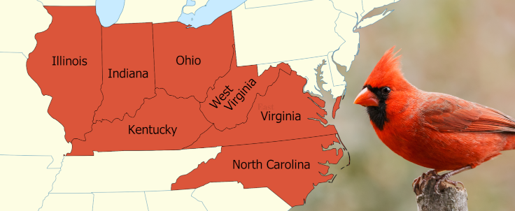
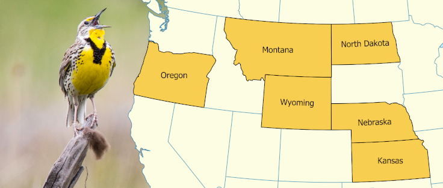
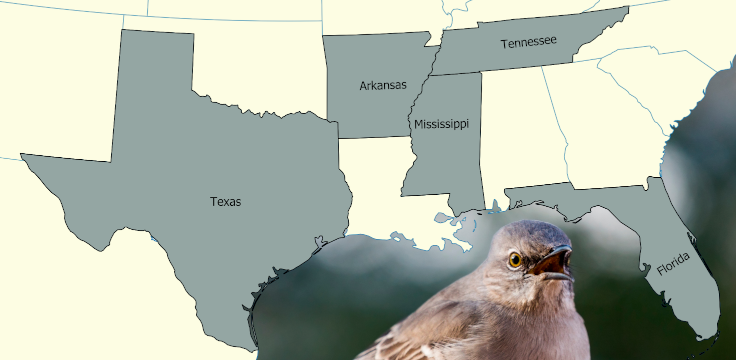

In [*The State Birds are Garbage*](https://www.youtube.com/watch?v=JAZI5GcPm8c),
Jam2go calculates "BIRD Uniqueness Points" for each (bird,state) pair, 
and uses this to assign new state birds.

<!--<iframe width="560" height="315" maxwidth="100%" src="https://www.youtube-nocookie.com/embed/JAZI5GcPm8c" title="YouTube video player" frameborder="0" allow="accelerometer; autoplay; clipboard-write; encrypted-media; gyroscope; picture-in-picture" allowfullscreen></iframe>-->

The video is about much more than that, and is definitely worth a watch,
but I found the results of the exercise dissapointing. 
As such, I downloaded 200 gigs of bird data and reran the numbers myself.

  

    Table of contents
  

- TOC
{:toc}

## The Problems with Jam2go's BIRDUP

### The Warbler Problem

We want our new set of state birds to be full of variety.

Jam2go's metric gives us a bunch of warblers.

Even after explicitly excluding warblers, 
their metric gives both the Lesser Prarie Chicken and Greater Prarie Chicken as state birds.
I know one is two inches longer, but that's still too samey for my taste.

I rank the birds by Genus, and then pick an example species.

<!--Species devisions are somewhat fuzzy, and sometimes based on where different subpopulations live.
This means if -->

### A different formula.

A state's bird should be somewhat special to that state.
But it should also be evocative of that state.
So I include a measure of the prevalence of the bird in my scoring.

TODO: Details about scoring.

## The Results

### Using a Weighted Variant of the [Phi Coefficient](https://en.wikipedia.org/wiki/Phi_coefficient)

## State Bird Tiebreakers

Most of the unique state birds are pretty swell.
But there's a few big blocks of states that all share the same bird.
Let's try to decide which state has the best claim on each of these critters.

### The Cardinal States

Across the temperate forests of the east.

### The Meadowlark States 

<!--https://ebird.org/science/status-and-trends/wesmea/abundance-map-weekly-->

Just like the cardinal is spread across the temperate forests of the east, the Meadowlark can be found all across the Great Plains. 
So 5 of these states - Montana, North Dakota, Wyoming, Nebraska, and Kansas  - have pretty goods claims on this little yellow fellow.

But Oregon, what do you think you're doing in the Meadowlark club? 
Get outta here. 
There are probably about 20 states that have a better claim to the Meadowlark than you do, Oregon.

Oregon can have the [scrub jay](https://en.wikipedia.org/wiki/California_scrub_jay) instead.

If only one state can keep the Meadowlark, then my numbers say it should go to either Kansas or Nebraska. 
And whichever of the two doesn't get the Meadowlark ends up with the Dickcissel.
The Dickcissel looks like an off-brand Meadowlark, but has [some pretty impressive migratory patterns](https://ebird.org/science/status-and-trends/dickci/abundance-map-weekly).

### The Mockingbird States

5 States claim the Northern Mockingbird as their state bird:
Texas, Arkansas, Mississippi, Tennessee, and Florida.
And indeed, Mockingbirds are common all across the American Southeast.

Texas and Florida have the strongest claims to the the bird based on my scoring, 
and you can see in [this map of mockingbird abundance](https://ebird.org/science/status-and-trends/normoc/abundance-map-weekly) that those two states are hotspots for Mockingbirds.

But Texas and Florida are also just generally birdular. 
Both states have even stronger claims to other birds.
Texas has the Caracara, an unusual type of falcon which [looks like a little cowdoy](https://www.youtube.com/watch?v=hSsdzO9-HY8).
And Florida has has all manner of Darters and Herons and other Water Birds.

<!--https://ebird.org/science/status-and-trends/y00678/abundance-map-->

So the state which gets the mockingbird by my reckoning is the one which doesn't have even stronger ties to some other bird.
And that state turns out to be ... *drum roll* ... Alabama?
Wait. Let me double check. Yeah. 

What of Alabama's unique state bird, the Northern Flicker, aka the Yellowhammer?
Alabama is known as "The Yellowhammer State" after all.
But this nickname doesn't refer to the abundance of Yellowhammers in the state; they're not particularly common in Alabama.<!--https://ebird.org/science/status-and-trends/norfli/abundance-map-weekly-->
The nickname actually comes from the style of civil war Alabama military uniforms:

> On the sleeves, collars and coattails of the new calvary troop were bits of brilliant yellow cloth. As the company rode past Company A , Will Arnett cried out in greeting "Yellowhammer, Yellowhammer, flicker, flicker!" The greeting brought a roar of laughter from the men and from that moment the Huntsville soldiers were spoken of as the "yellowhammer company." The term quickly spread throughout the Confederate Army and all Alabama troops were referred to unofficially as the "Yellowhammers."

(Depending on how I fiddle with the formulas and data cleaning steps, I can also swing it so that Tennessee gets the Mockingbird.
But *To Kill a Mockingbird* is set in Alabama, so it fits pretty well.)

### The Goldfinch States

<!--
| State | Bird | Common Name | Example Species | Common Name |
|---|---|---|---|---|
| US-AK | [Aethia](https://en.wikipedia.org/wiki/Aethia) | Auklet | [Aethia psittacula](https://en.wikipedia.org/wiki/Aethia_psittacula) |  |
| US-AL | [Mimus](https://en.wikipedia.org/wiki/Mimus) | Mockingbird | [Mimus polyglottos](https://en.wikipedia.org/wiki/Mimus_polyglottos) | Northern Mockingbird |
| US-AR | [Passerina](https://en.wikipedia.org/wiki/Passerina) | Bunting | [Passerina cyanea](https://en.wikipedia.org/wiki/Passerina_cyanea) | Indigo Bunting |
| US-AZ | [Auriparus](https://en.wikipedia.org/wiki/Auriparus) | Verdin | [Auriparus flaviceps](https://en.wikipedia.org/wiki/Auriparus_flaviceps) | Verdin |
| US-CA | [Chamaea](https://en.wikipedia.org/wiki/Chamaea) | Wrentit | [Chamaea fasciata](https://en.wikipedia.org/wiki/Chamaea_fasciata) | Wrentit |
| US-CO | [Pica](https://en.wikipedia.org/wiki/Pica_(genus)) | Magpie | [Pica hudsonia](https://en.wikipedia.org/wiki/Pica_hudsonia) | Black-billed Magpie |
| US-CT | [Baeolophus](https://en.wikipedia.org/wiki/Baeolophus) | Titmouse | [Baeolophus bicolor](https://en.wikipedia.org/wiki/Baeolophus_bicolor) | Tufted Titmouse |
| US-DC | [Chaetura](https://en.wikipedia.org/wiki/Chaetura) | Swift | [Chaetura pelagica](https://en.wikipedia.org/wiki/Chaetura_pelagica) | Chimney Swift |
| US-DE | [Leucophaeus](https://en.wikipedia.org/wiki/Leucophaeus) | Gull | [Leucophaeus atricilla](https://en.wikipedia.org/wiki/Leucophaeus_atricilla) | Laughing Gull |
| US-FL | [Anhinga](https://en.wikipedia.org/wiki/Anhinga) | Darter | [Anhinga anhinga](https://en.wikipedia.org/wiki/Anhinga_anhinga) | Anhinga |
| US-GA | [Toxostoma](https://en.wikipedia.org/wiki/Toxostoma) | Thrasher | [Toxostoma rufum](https://en.wikipedia.org/wiki/Toxostoma_rufum) | Brown Thrasher |
| US-HI | [Geopelia](https://en.wikipedia.org/wiki/Geopelia) |  | [Geopelia striata](https://en.wikipedia.org/wiki/Geopelia_striata) |  |
| US-IA | [Passer](https://en.wikipedia.org/wiki/Passer) | True Sparrow | [Passer montanus](https://en.wikipedia.org/wiki/Passer_montanus) | Eurasian Tree Sparrow |
| US-ID | [Oreoscoptes](https://en.wikipedia.org/wiki/Oreoscoptes) | Sage Thrasher | [Oreoscoptes montanus](https://en.wikipedia.org/wiki/Oreoscoptes_montanus) | Sage Thrasher |
| US-IL | [Centronyx](https://en.wikipedia.org/wiki/Centronyx) | Sparrow | [Centronyx henslowii](https://en.wikipedia.org/wiki/Centronyx_henslowii) | Henslow's Sparrow |
| US-IN | [Melanerpes](https://en.wikipedia.org/wiki/Melanerpes) | Woodpecker | [Melanerpes erythrocephalus](https://en.wikipedia.org/wiki/Melanerpes_erythrocephalus) | Red-headed Woodpecker |
| US-KS | [Spiza](https://en.wikipedia.org/wiki/Spiza) | Dickcissel | [Spiza americana](https://en.wikipedia.org/wiki/Spiza_americana) | Dickcissel |
| US-KY | [Cardinalis](https://en.wikipedia.org/wiki/Cardinalis) | Cardinal | [Cardinalis cardinalis](https://en.wikipedia.org/wiki/Cardinalis_cardinalis) | Northern Cardinal |
| US-LA | [Egretta](https://en.wikipedia.org/wiki/Egretta) | Egret | [Egretta thula](https://en.wikipedia.org/wiki/Egretta_thula) | Snowy Egret |
| US-MA | [Calonectris](https://en.wikipedia.org/wiki/Calonectris) | Shearwater | [Calonectris diomedea](https://en.wikipedia.org/wiki/Calonectris_diomedea) | Cory's Shearwater |
| US-MD | [Coragyps](https://en.wikipedia.org/wiki/Coragyps) | Black Vulture | [Coragyps atratus](https://en.wikipedia.org/wiki/Coragyps_atratus) | Black Vulture |
| US-ME | [Somateria](https://en.wikipedia.org/wiki/Somateria) | Eider | [Somateria mollissima](https://en.wikipedia.org/wiki/Somateria_mollissima) | Common Eider |
| US-MI | [Cygnus](https://en.wikipedia.org/wiki/Swan) | Swan | [Cygnus olor](https://en.wikipedia.org/wiki/Cygnus_olor) | Mute Swan |
| US-MN | [Aix](https://en.wikipedia.org/wiki/Aix_(bird)) | Wood Duck | [Aix sponsa](https://en.wikipedia.org/wiki/Aix_sponsa) | Wood Duck |
| US-MO | [Colinus](https://en.wikipedia.org/wiki/Colinus) | Bobwhite | [Colinus virginianus](https://en.wikipedia.org/wiki/Colinus_virginianus) | Northern Bobwhite |
| US-MS | [Thalasseus](https://en.wikipedia.org/wiki/Thalasseus) | Crested Tern | [Thalasseus maximus](https://en.wikipedia.org/wiki/Thalasseus_maximus) | Royal Tern |
| US-MT | [Nucifraga](https://en.wikipedia.org/wiki/Nucifraga) | Nutcracker | [Nucifraga columbiana](https://en.wikipedia.org/wiki/Nucifraga_columbiana) | Clark's Nutcracker |
| US-NC | [Pterodroma](https://en.wikipedia.org/wiki/Pterodroma) | Gadfly Petrel | [Pterodroma hasitata](https://en.wikipedia.org/wiki/Pterodroma_hasitata) |  |
| US-ND | [Tympanuchus](https://en.wikipedia.org/wiki/Tympanuchus) | Prarie Chicken | [Tympanuchus phasianellus](https://en.wikipedia.org/wiki/Tympanuchus_phasianellus) | Sharp-tailed Grouse |
| US-NE | [Sturnella](https://en.wikipedia.org/wiki/Sturnella) | Meadowlark | [Sturnella neglecta](https://en.wikipedia.org/wiki/Sturnella_neglecta) | Western Meadowlark |
| US-NH | [Tadorna](https://en.wikipedia.org/wiki/Tadorna) | Shelduck | [Tadorna tadorna](https://en.wikipedia.org/wiki/Tadorna_tadorna) |  |
| US-NJ | [Haematopus](https://en.wikipedia.org/wiki/Haematopus) | Oystercatcher | [Haematopus palliatus](https://en.wikipedia.org/wiki/Haematopus_palliatus) | American Oystercatcher |
| US-NM | [Geococcyx](https://en.wikipedia.org/wiki/Geococcyx) | Roadrunner | [Geococcyx californianus](https://en.wikipedia.org/wiki/Geococcyx_californianus) | Greater Roadrunner |
| US-NV | [Callipepla](https://en.wikipedia.org/wiki/Callipepla) | Crested Quail | [Callipepla gambelii](https://en.wikipedia.org/wiki/Callipepla_gambelii) | Gambel's Quail |
| US-NY | [Dumetella](https://en.wikipedia.org/wiki/Dumetella) | Gray Catbird | [Dumetella carolinensis](https://en.wikipedia.org/wiki/Dumetella_carolinensis) | Gray Catbird |
| US-OH | [Protonotaria](https://en.wikipedia.org/wiki/Protonotaria) | Prothonotary warbler | [Protonotaria citrea](https://en.wikipedia.org/wiki/Protonotaria_citrea) | Prothonotary Warbler |
| US-OK | [Ictinia](https://en.wikipedia.org/wiki/Ictinia) | Mississippi Kite | [Ictinia mississippiensis](https://en.wikipedia.org/wiki/Ictinia_mississippiensis) | Mississippi Kite |
| US-OR | [Aphelocoma](https://en.wikipedia.org/wiki/Aphelocoma) | Scrub Jay | [Aphelocoma californica](https://en.wikipedia.org/wiki/Aphelocoma_californica) | California Scrub-Jay |
| US-PA | [Hylocichla](https://en.wikipedia.org/wiki/Hylocichla) | Wood Thrush | [Hylocichla mustelina](https://en.wikipedia.org/wiki/Hylocichla_mustelina) | Wood Thrush |
| US-RI | [Phalacrocorax](https://en.wikipedia.org/wiki/Phalacrocorax) | Cormorant | [Phalacrocorax carbo](https://en.wikipedia.org/wiki/Phalacrocorax_carbo) | Great Cormorant |
| US-SC | [Mycteria](https://en.wikipedia.org/wiki/Mycteria) | Stork | [Mycteria americana](https://en.wikipedia.org/wiki/Mycteria_americana) | Wood Stork |
| US-SD | [Bartramia](https://en.wikipedia.org/wiki/Bartramia_(bird)) | Upland Sandpiper | [Bartramia longicauda](https://en.wikipedia.org/wiki/Bartramia_longicauda) | Upland Sandpiper |
| US-TN | [Sialia](https://en.wikipedia.org/wiki/Sialia) | Bluebird | [Sialia sialis](https://en.wikipedia.org/wiki/Sialia_sialis) | Eastern Bluebird |
| US-TX | [Caracara](https://en.wikipedia.org/wiki/Caracara_(genus)) | Caracara | [Caracara plancus](https://en.wikipedia.org/wiki/Caracara_plancus) |  |
| US-UT | [Aechmophorus](https://en.wikipedia.org/wiki/Aechmophorus) | Grebe | [Aechmophorus clarkii](https://en.wikipedia.org/wiki/Aechmophorus_clarkii) | Clark's Grebe |
| US-VA | [Thryothorus](https://en.wikipedia.org/wiki/Thryothorus) | Carolina Wren | [Thryothorus ludovicianus](https://en.wikipedia.org/wiki/Thryothorus_ludovicianus) | Carolina Wren |
| US-VT | [Seiurus](https://en.wikipedia.org/wiki/Seiurus) | Ovenbird | [Seiurus aurocapilla](https://en.wikipedia.org/wiki/Seiurus_aurocapilla) | Ovenbird |
| US-WA | [Cerorhinca](https://en.wikipedia.org/wiki/Cerorhinca) | Rhinoceros Puffin | [Cerorhinca monocerata](https://en.wikipedia.org/wiki/Cerorhinca_monocerata) | Rhinoceros Auklet |
| US-WI | [Antigone](https://en.wikipedia.org/wiki/Antigone_(bird)) | Crane | [Antigone canadensis](https://en.wikipedia.org/wiki/Antigone_canadensis) | Sandhill Crane |
| US-WV | [Dryocopus](https://en.wikipedia.org/wiki/Dryocopus) | Woodpecker | [Dryocopus pileatus](https://en.wikipedia.org/wiki/Dryocopus_pileatus) | Pileated Woodpecker |
| US-WY | [Centrocercus](https://en.wikipedia.org/wiki/Centrocercus) | Sage-grouse | [Centrocercus urophasianus](https://en.wikipedia.org/wiki/Centrocercus_urophasianus) | Greater Sage-Grouse |
-->

---

*Map data from [Natural Earth](https://www.naturalearthdata.com/downloads/).*  
*All photos from the National Park Service.*

