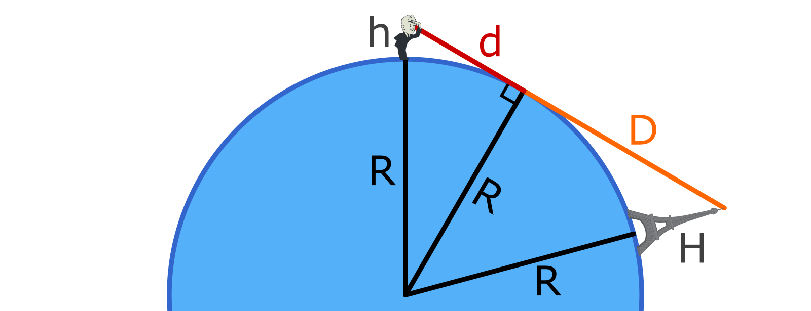

How far away can an object be before it dips below the horizon and is no longer visible?

For simplicity, treat the earth like a smooth perfect sphere, 
and ignore the atmosphere and any other obstacles. 

## Calculator

<fieldset>
    <legend>Parameters</legend>
    
    

    <label for="personHeight">Eye Height (in meters): </label>
    <input type="number" id="personHeight" name="personHeight"
        value="2" min="0" step="0.1"
        onchange='h = parseFloat(this.value); updateNumbers();'>
    
     
    
    

    <label for="mountainHeight">Height of Object (in meters): </label>
    <input type="number" id="mountainHeight" name="mountainHeight"
        value="100" min="0" step="1"
        onchange='H = parseFloat(this.value); updateNumbers();'>
    
   
    
    

    <label for="earthRadius">Radius of Earth (in meters): </label>
    <input type="number" id="earthRadius" name="earthRadius"
        value="6370000" min="0"  step="1"
        onchange='R = parseFloat(this.value); updateNumbers();'>
    
   
</fieldset>

<button onclick="updateNumbers()">⬇️ Update Results ⬇️</button>

<fieldset>
    <legend>Maximum distance at which object is visible:</legend>
    <!--The maximum distance at which you can still see the object is as follows: -->
    Arc distance along ground from feet to base: <b></b> meters. (<b></b> miles) 
    Straight-line distance from eyes to tip of object: <b></b> meters. (<b></b> miles) 
    <!--These numbers are evaluated to three sig figs.-->
</fieldset>

<!--https://sites.math.washington.edu/~conroy/m120-general/horizon.pdf

<label for="losDistance">Distance from eyes to tip of object: </label>
<input type="number" id="losDistance" name="losDistance" readonly value="0">
meters.

     
-->

    
    
    
    
## Table of Examples
    
Assuming that your eyes are 1.8 meters above the ground, 
(and the earth is perfectly spherical etc. etc.)
from how far away can you see the tops of various objects?
    
| Object | Object Height (m) | Visable Distance (m) | Vis. Dist. (miles) |
|:-:|:-:|:-:|:-:|
| The Ground Itself | 0 | 4,800 | 3.0 |
| Garden Gnome | 0.5 | 7,300 | 4.5 |
| Another Person | 1.8 | 9600 | 6.0 |
| A Male Giraffe | 5.2 | 13,000 | 8.0 |
| An Aspen Tree | 16 | 19,000 | 12 |
| Statue of Liberty | 93 | 39,000 | 24 |
| Burj Khalifa | 830 | 110,000 | 67 |
| Mount Everest | 8800 | 340,000 | 210 |
| Severe Thunderstorm | 18000 | 480,000 | 300 |
    

Arc distance along the ground is same as straight-line distance, up to the precision I used for these numbers.
Once you get up to the Mount Everest row, the difference is on the order of one mile.

<!--

http://biorefinery.utk.edu/technical_reviews/Tree%20Size.pdf

| Sauroposeidon | 18 | 19,900 | 12.4 |

https://www.chicagotribune.com/news/ct-xpm-2010-06-16-ct-wea-0617-asktom-20100616-story.html
http://www.theweatherprediction.com/habyhints2/536/

https://openclipart.org/detail/315971/retro-man-looking
https://openclipart.org/detail/278744/eiffel-tower

-->

## Equations

### Straight-line Distance
    
Assume the earth is a perfect sphere with radius $R_⊕$.

If your eyes are at height $h$ above the surface of the sphere, 
then the distance to the horizon is:

$$d = \sqrt{ {(R_⊕+H)}^2 - R_⊕^2}$$

Now suppose there's an object of height $H$ which is so far away that you can just barely see the top of it over the horizon.

The distance from the horizon to the top of that object is 

$$D = \sqrt{ {(R_⊕+H)}^2 - R_⊕^2 }$$

And the distance from your eyes to the top of that object is

$$distance = d + D = \sqrt{ {(R_⊕+h)}^2 - R_⊕^2} +  \sqrt{ {(R_⊕+H)}^2 - R_⊕^2 }$$

### Distance Along the Ground

Unless you're looking at something *really* tall, the arc-length distance along the ground will be roughly the same as the straight-line distance.

But it you want to know the exact distance along the ground, the formula is 

$$arclength = (\theta_1 + \theta_2) \cdot R_⊕$$

Where the angles are

$$\theta_1 = \arccos \left(\frac{R_⊕}{R_⊕+h}\right)$$

$$\theta_2 = \arccos \left(\frac{R_⊕}{R_⊕+H}\right)$$

